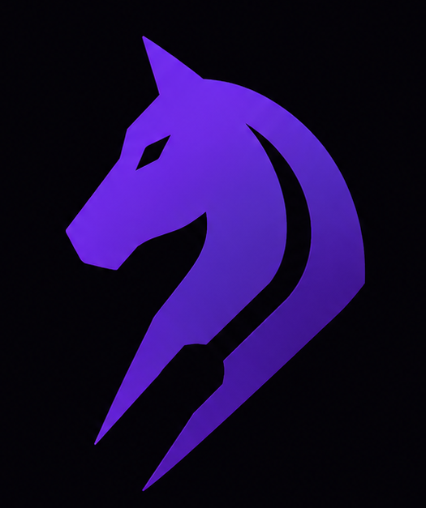

<div align="center">
  

  <h1>Forked</h1>
  <p><strong>"A coach who knows exactly how you lose."</strong></p>
  <p>
    A complete adaptive chess training platform. Forked watches your real game
    history and detects your personal recurring blindspots with a chess
    transformer + a deterministic skill-family profile — then surrounds that core
    loop with a persistent agentic AI coach, an interactive opening explorer, an
    endgame trainer, a human-like bot to practise against, and an intelligence
    layer that tracks repeats live, replays your mistakes, estimates the rating
    they cost you, and renders a shareable Chess DNA card.
  </p>
</div>

---

## What Forked is

Forked started as a personalised blindspot trainer and has grown into a full
learning suite. Six pillars, all built around the same engine + data stack:

| Pillar | What it does |
|---|---|
| **Blindspot Profile** | Pull your last 80–200 games, annotate every move with Stockfish, classify each mistake with a **chess transformer (83.1% acc)**, and group them into your top recurring **skill families** ("Loose-piece awareness — 99 mistakes"). |
| **Forked Coach** | A **persistent agentic coach** (Groq Llama-3.3-70B + 6 tools) that knows your games, blindspots, drills and history. Streams answers, shows inline solvable puzzles, analyses pasted games, explains positions, remembers prior sessions, and talks (audio mode). The capstone that ties every feature together. |
| **Drill Session** | Spaced-repetition puzzle queue targeting *your* blindspot families, retrieved from 100K+ Lichess puzzles by theme + rating band. |
| **Openings** | Interactive lazy-loaded opening tree from real Lichess game data — engine eval, win/draw/loss bars and AI "typical ideas" on every node, plus a RAG opening coach grounded in chess literature. |
| **Endgames** | A theory tree of canonical positions (Syzygy-verified), practice vs a human-like bot from any material configuration, and a tablebase-grounded endgame coach. |
| **Play vs Maia** | Play full games against Maia (human-move model) tuned near your rating, then get a Stockfish accuracy report, a blindspot debrief, and an interactive game-analysis view. |

### Intelligence layer

Five features that turn the blindspot graph into a living feedback loop. All
identify clusters by their **family `cluster_id`** (a stable skill-family key,
never a mutable LLM label):

| Feature | What it does |
|---|---|
| **Live sync + alerts** | A background loop polls for new games, re-runs Stage 1, and the moment you repeat a known blindspot it raises a dashboard alert + resets that cluster's mastery. |
| **Post-game debrief** | After a Maia game, every mistake is matched against your clusters — "you triggered 1 known weakness in this game" — instead of a generic accuracy number. |
| **Mistake Replay** | Walk every real-game position in a cluster: eval bar, free piece exploration, a unique per-position "Notice", and a Groq one-line pattern insight. |
| **Counterfactual rating** | "Fix these patterns → +67 points." A bounded performance-rating estimate of what each blindspot costs you, with per-cluster `+N pts` badges. |
| **Chess DNA card** | A shareable 1200×630 PNG: your 5-axis style archetype ("The Attacker") + top blindspots + counterfactual, with a public `/dna/{username}` landing page. |

Product name: **Forked**. Tagline: *"A coach who knows exactly how you lose."*

---

## Why this is defensible

- Chess.com could build the blindspot loop but won't — their Learn section is a revenue line, not a priority.
- The moat is the per-user blindspot graph. It gets richer with every game and can't be replicated by a fresh account.
- The feedback loop is the key: when a user blunders the same pattern in a real game, the system detects it and resets that cluster's mastery score. No static puzzle platform does this.
- The surrounding tools (openings, endgames, coaches, bot) make Forked a daily-use product, not a one-time audit — every one of them is grounded in real data or tablebases, not generic AI text.

---

## The core ML pipeline (3 stages)

```
Your Lichess / Chess.com username
        |
        v
 [Stage 1 — Ingestion & Classification]
  Fetch last 80–200 games via public API (no login)
  Annotate every position: Stockfish depth-12 screen → depth-18 on mistakes
  Extract mistake events where eval_drop >= 100cp (blunders)
  Chessformer transformer classifies the motif directly (no rule funnel)
  Maia2 filter: discard universally-hard positions (not personal blindspots)
        |
        v
 [Stage 2 — Blindspot family profile]
  Map each mistake's threat type → 1 of 5 skill families (deterministic)
  loose_pieces · alignment · defender_disruption · king_safety · positional
  Score each family: frequency × recency × severity (eval-drop capped at 1000cp)
  No UMAP / HDBSCAN / LLM at request time — stable, instant, label-free keys
        |
        v
 [Stage 3 — Puzzle Retrieval & SRS]
  100K+ Lichess puzzles indexed locally with their Lichess theme tags
  Allocate a puzzle budget across families by blindspot score
  Query each family's themes within the user's rating band
  SM-2 spaced repetition — mastery per family, resets on live blunders
```

### Chess transformer classifier (Stage 1)

A **Chessformer** (64 square-tokens, side-to-move oriented, Shaw relative
attention, 6 layers, SupCon + CE training) classifies each mistake's motif
**directly from the network** — the old rule → depth → LightGBM funnel was
dropped. Confidence is temperature-calibrated softmax; positions whose SupCon
embedding looks unlike any learned tactic are routed to `other` (positional).
14 threat categories, **83.1% accuracy** (up from 63.5% with LightGBM). Loads
from `models/stage1_transformer.pt` + `stage1_reference.pkl`.

### Blindspot families (Stage 2)

Instead of learned clustering, mistakes collapse into a **fixed 5-family
taxonomy** by shared skill — clustering on board geometry produced motif-agnostic
clusters (ARI ≈ 0), whereas grouping by the skill that failed is both coherent
and trainable. Each family is identified by a stable `cluster_id` string; the
whole intelligence layer keys on it. See **instructions/AGENT.md** for the full backend map.

---

## The learning surfaces

### Forked Coach  (`/coach`)  — the capstone
- A **persistent agentic coach** built on Groq `llama-3.3-70b-versatile` with **6 callable tools**, streamed over SSE with mid-conversation tool orchestration.
- **Three personalisation layers**: a one-time onboarding questionnaire (cold start), a rolling cross-session memory summary, and a live game-data context block injected every session — so it opens already knowing your recent games and top blindspot.
- **Tools**: pull your real mistake positions, explain any FEN (C1-ready, Stockfish fallback), serve an inline **solvable** puzzle, analyse a pasted PGN/FEN, and query the opening/endgame knowledge bases.
- **Modes**: Coach · Puzzle · Import · Theory · **Audio** (browser-native speech-to-text + text-to-speech, Chrome/Edge). Inline boards render right in the chat; mistake positions are navigable with a live eval bar.

### Openings Explorer  (`/openings`)
- Lazy-loaded tree from the live **Lichess Opening Explorer API**, filtered to your rating band.
- Every node shows a mini-board thumbnail, engine eval, popularity and a WDL bar.
- Detail panel: full board, ECO + name, Stockfish eval, AI-generated "typical ideas".
- Fuzzy opening search ("veina" → Vienna) jumps the tree to any named line.
- **Opening Coach** — streaming RAG chatbot grounded in a curated opening corpus + live Lichess stats, rating-aware, with source citations. Independent of the tree.

### Endgames  (`/endgames`)  — three tabs
- **Theory** — a hardcoded tree of canonical positions (K+P, K+R, K+Q, minor-piece, rook, pawn endings). Each leaf is **Syzygy-verified** (≤7-piece tablebase) with result, difficulty and key idea.
- **Practice** — a piece configurator (pick exact material or type "queen pawn endgame") fetches an *instructive* position (Lichess puzzle DB first, Stockfish-filtered generation as fallback), then you play it out vs Maia. The result is judged against the theoretical objective ("Correct draw!" / "You drew a winning position").
- **Coach** — a streaming endgame RAG chatbot that injects **Syzygy results as verified fact** and shows a "Tablebase verified" badge.

### Play vs Maia  (`/bot-game`)
- Full games against the **Maia2** human-move model, tuned near your rating, with human-like thinking delays.
- Move history is navigable (click or ← / →), board flips to your colour, check highlighting, promotion dialogue.
- After the game: a **Stockfish accuracy report** (chess.com-style %) and an **Analyse Game** view with engine eval on every move.

### Analysis Board  (`/analysis`)
- Free-play board with live Stockfish eval bar, best-move arrows, move list, flip, FEN copy.
- Opens directly from any position via `?fen=` or from the endgame theory panel.

---

## Tech stack

**Backend** — Python 3.10+, FastAPI, `python-chess` + Stockfish, a **PyTorch
chess transformer** (Stage 1 classifier), Maia2 (PyTorch), Groq (LLM coaches +
the agentic Forked Coach with tool-calling), Pillow (DNA card PNG), SQLite for
caches. Stage 2 is a deterministic family map (no UMAP/HDBSCAN/LLM at request
time). Background annotation + live sync run in worker threads with SSE progress.
Position explanation prefers **C1** (CSSLab, via a vLLM endpoint when configured)
and always falls back to Stockfish.

**Frontend** — React + TypeScript, Vite, `chess.js` + `react-chessboard`,
TanStack Query, Zustand, Tailwind, Framer Motion. WebSockets for live games,
manual SSE parsing for streaming coach responses.

**Data** — Lichess puzzle DB (100K sample indexed), Lichess Opening Explorer
API, Syzygy tablebase API (`tablebase.lichess.ovh`), curated JSON corpora for
the coaches.

> **No PostgreSQL / pgvector.** Position embeddings are 16-dim UMAP vectors;
> numpy L2 over 100K puzzles runs in <50 ms in memory. All caches (eval, ideas,
> Syzygy, suggestions) are SQLite files under `data/`.

---

## Backend API (`backend/`, FastAPI)

The backend is split into eight routers, all mounted on one app (see **instructions/AGENT.md**
for the full architecture):

```
backend/main.py          — ingestion, profile, analytics, drills, analysis, bot-game (+ WS), debrief
backend/openings.py      — opening explorer: explore / eval / ideas
backend/opening_chat.py  — opening coach: chat / chat/stream / suggestions
backend/endgames.py      — endgames: practice-position(/by-config) / syzygy / coach
backend/live_sync.py     — background sync + blindspot alerts
backend/replay.py        — mistake replay: per-cluster mistakes / insight / note / explain
backend/counterfactual.py— counterfactual rating estimate
backend/card.py          — Chess DNA: compute-style / style / dna-card (Pillow PNG)
backend/coach/           — Forked Coach package: chat (SSE+tools) / questionnaire / profile / memory
backend/bot/             — Maia2 move generator + human thinking-delay
```

| Area | Endpoints |
|---|---|
| **Ingestion / profile** | `POST /api/ingest`, `GET /api/ingest/status/{job}` (SSE), `GET /api/profile/{user}`, `GET /api/cluster/{user}/{id}`, `GET /api/games/{user}`, `GET /api/analytics/{user}` |
| **Drills / SRS** | `GET /api/session/{user}`, `POST /api/session/complete` |
| **Analysis** | `GET /api/analyse?fen=…&depth=` |
| **Openings** | `GET /api/openings/explore`, `/eval`, `POST /api/openings/ideas`, `POST /api/openings/chat(/stream)`, `GET /api/openings/chat/suggestions` |
| **Endgames** | `GET /api/endgames/practice-position`, `POST /api/endgames/practice-position/by-config`, `GET /api/endgames/syzygy`, `POST /api/endgames/coach/chat(/stream)`, `GET /api/endgames/coach/suggestions` |
| **Play vs Maia** | `POST /api/bot-game/create`, `GET /api/bot-game/{id}`, `WS /ws/bot-game/{id}`, `POST /api/bot-game/accuracy`, `POST /api/bot-game/{id}/debrief` |
| **Live sync / alerts** | `GET /api/alerts/{user}`, `POST /api/alerts/{user}/mark-seen`, `GET /api/sync/status/{user}`, `POST /api/sync/trigger/{user}` |
| **Mistake Replay** | `GET /api/cluster/{user}/{id}/mistakes`, `/insight`, `POST /api/cluster/note`, `POST /api/cluster/explain` |
| **Counterfactual / DNA** | `GET /api/profile/{user}/counterfactual`, `POST /api/profile/{user}/compute-style`, `GET /api/profile/{user}/style`, `GET /api/profile/{user}/dna-card` |
| **Forked Coach** | `POST /api/coach/chat` (SSE + tools), `POST /api/coach/save-questionnaire`, `GET /api/coach/profile/{user}`, `POST /api/coach/update-memory/{user}` |
| **Settings** | `GET/PUT /api/settings/{user}`, `GET /api/check/{user}` |

---

## Project structure

```
Forked/
├── requirements.txt
├── CLAUDE.md                          # Project context for Claude Code (kept at root)
├── instructions/                      # All docs + build prompts
│   ├── AGENT.md                       #   Full backend architecture reference
│   ├── stage1.md                      #   Detailed Stage 1 developer reference
│   └── *_PROMPT.md                    #   Feature build prompts (coach, homepage, …)
├── planned_improvements/              # Backlog per stage
├── scripts/
│   ├── setup_stockfish.py             # Download Stockfish binary
│   ├── run_analysis.py                # Stage 1 CLI
│   ├── build_training_data.py         # Classifier training data from Lichess puzzles
│   ├── train_classifier.py            # Train LightGBM threat classifier
│   ├── evaluate_classifier.py         # Evaluate classifier on test set
│   ├── verify_category_alignment.py   # Assert rule-based + ML labels in sync
│   ├── run_puzzle_import.py           # Build the puzzle retrieval index
│   └── build_endgame_positions.py     # Build endgame.db (+ optional Syzygy verify)
├── ml/
│   ├── config.py                      # Paths, thresholds, feature flags
│   ├── pipeline.py                    # Stage 1 orchestrator
│   ├── ingestion/                     # fetcher, annotator, mistake_extractor,
│   │                                  #   threat_classifier, maia_annotator
│   ├── classifier/                    # transformer/ (Chessformer: model, predict,
│   │                                  #   board_encoding, classifier), label_map
│   ├── clustering/                    # families, profile, profile_pipeline,
│   │                                  #   blindspot (legacy pipeline kept for rollback)
│   ├── matching.py                    # event → family_of(threat_type) (no scaler/reducer)
│   ├── style/extractor.py             # 5-axis Chess DNA style profile + archetype
│   ├── puzzles/                       # importer, retriever (query_by_themes)
│   └── srs/                           # scheduler (SM-2), session builder (family allocation)
├── models/                            # stage1_transformer.pt, stage1_reference.pkl
├── backend/
│   ├── main.py                        # Core API + bot-game WebSocket + debrief
│   ├── openings.py                    # Opening explorer router
│   ├── opening_chat.py                # Opening coach (RAG + streaming)
│   ├── endgames.py                    # Endgames router (practice / syzygy / coach)
│   ├── live_sync.py                   # Background sync + blindspot alerts
│   ├── replay.py                      # Mistake Replay (mistakes / insight / note / explain)
│   ├── counterfactual.py              # Counterfactual rating estimate
│   ├── card.py                        # Chess DNA card (Pillow PNG) + style endpoints
│   ├── coach/                         # Forked Coach (capstone agentic coach)
│   │   ├── router.py                  #   /api/coach chat (SSE + tools) + endpoints
│   │   ├── profile.py                 #   questionnaire + memory file IO (Layers 1 & 2)
│   │   ├── context.py                 #   live user-context block (Layer 3)
│   │   ├── memory.py                  #   rolling Groq session summary
│   │   ├── tools.py                   #   6 agent tools + dispatch
│   │   └── explain.py                 #   explain_position: C1 → Stockfish fallback
│   └── bot/
│       ├── maia_engine.py             # Maia2 move generator (+ first-move guard)
│       └── thinking_delay.py          # Human-like delay simulator
├── data/
│   ├── opening_cache.db               # Opening eval / ideas / lichess / suggestions
│   ├── opening_knowledge.json         # Curated opening coach corpus (47 entries)
│   ├── endgame.db                     # Practice positions + Syzygy + suggestions
│   ├── endgame_positions.json         # Curated practice positions (66)
│   ├── endgame_knowledge.json         # Curated endgame coach corpus (25 entries)
│   ├── puzzles/                       # Lichess puzzle index (npz + meta.json)
│   └── output/                        # Per-user state: mistakes / clusters / settings /
│                                      #   alerts / sync / style / counterfactual / dna_card.png
├── frontend/
│   └── src/
│       ├── pages/                     # Dashboard, Coach, PuzzleSession, OpeningExplorer,
│       │                              #   Endgames, BotGame, AnalysisBoard,
│       │                              #   MistakeReplay, DNAPage, …
│       ├── components/
│       │   ├── layout/                # AppShell, SectionHeader, ChessBackground
│       │   ├── coach/                 # CoachBoard (inline puzzle / view / review board)
│       │   ├── openings/              # OpeningTree, OpeningDetail, OpeningCoachChat,
│       │   │                          #   MiniBoardThumbnail
│       │   ├── endgames/              # EndgameTree, EndgameDetail, EndgamePractice,
│       │   │                          #   EndgameCoach, PieceConfigurator
│       │   ├── dashboard/             # BlindspotAlerts, RatingImpact
│       │   ├── BotGameDebrief.tsx     # Post-game blindspot debrief
│       │   └── ChessDNACard.tsx       # Style archetype + axis bars
│       ├── hooks/                     # useGameReview, useAudioCoach (STT/TTS)
│       ├── data/                      # endgameTree.ts, openings_index.json
│       └── api/                       # index, coach, openings, endgames, replay, insights, live
└── tests/
    └── test_hybrid_classifier.py      # 13 unit tests for known tactical positions
```

---

## Setup

### Prerequisites
- Python 3.10+, Node.js 18+, Windows / macOS / Linux

### 1 — Clone and install
```bash
git clone https://github.com/ShahuPatil07/Forked
cd Forked

python -m venv .venv
.venv\Scripts\activate          # Windows
# source .venv/bin/activate     # macOS / Linux

pip install -r requirements.txt
```

> `torch` (Maia2 dependency) installs separately, CPU build:
> `pip install torch --index-url https://download.pytorch.org/whl/cpu`

### 2 — Environment
Create `.env` in the project root:
```
GROQ_API_KEY=gsk_...     # Free at console.groq.com — powers the LLM coaches, the Forked Coach + insights
LICHESS_TOKEN=lip_...    # Free at lichess.org/account/oauth/token — needed for the Opening Explorer API
# C1_ENDPOINT=http://...  # Optional: a vLLM C1 (CSSLab) OpenAI-compatible endpoint for richer
#                         # position explanations. Omit it and the coach uses the Stockfish fallback.
```

### 3 — Download Stockfish
```bash
python scripts/setup_stockfish.py
```

### 4 — Build data indexes (one-time)
```bash
python scripts/run_puzzle_import.py        # Lichess puzzle retrieval index (Drills + Endgame practice)
python scripts/build_endgame_positions.py  # Endgame practice DB  (add --verify for Syzygy check)
```

### 5 — Run
```bash
# Backend
uvicorn backend.main:app --reload --port 8000

# Frontend (separate terminal)
cd frontend && npm install && npm run dev    # http://localhost:5173
```

Open `http://localhost:5173`, enter your Lichess/Chess.com username, and click
Analyse. The Openings, Endgames and Play-vs-Maia sections work without a
profile.

---

## Standalone CLI (blindspot pipeline)

```bash
python scripts/run_analysis.py ShahuPatil07 --platform lichess --games 80
# → data/output/ShahuPatil07_mistakes.json

# Retrain the threat classifier from scratch:
python scripts/build_training_data.py --resume --max 2000000   # ~30 min, downloads puzzle DB
python scripts/train_classifier.py
python scripts/evaluate_classifier.py --no-plot
python scripts/verify_category_alignment.py
```

---

## Key configuration (`ml/config.py`)

| Variable | Default | Meaning |
|---|---|---|
| `MISTAKE_THRESHOLD_CP` | 100 | Min centipawn drop to record a mistake (blunders only) |
| `ANNOTATION_DEPTH_FAST` | 12 | Stockfish depth for initial screen |
| `ANNOTATION_DEPTH_FULL` | 18 | Stockfish depth for deep re-analysis |
| `USE_MAIA2` | True | Enable Maia2 human-probability filter |
| `MAIA2_MIN_PROB_BEST` | 0.04 | Discard events below this human probability |
| `EXCLUDE_OPENING_MISTAKES` | False | Include mistakes in moves 1–20 |

---

## Key design decisions

**No PCA on bitboards** — LightGBM splits on individual binary features; PCA destroys the sparse "white queen on d5" structure trees use. Raw 805-dim beats PCA-64 by +4.5pp.

**Hybrid classifier, not just rules** — rule-based covers ~65% at certainty 1.0; the rest goes through LightGBM with per-class confidence thresholds to minimise false positives in rare classes.

**Curated corpora, not a full RAG scrape** — both coaches are grounded in hand-curated JSON corpora (openings + endgames) injected by ECO/material/keyword match, plus live data (Lichess stats / Syzygy). No vector DB, no multi-hour scrape, sources still cited.

**Syzygy as ground truth** — endgame results and the post-game verdict are checked against the Lichess tablebase (≤7 pieces). The coach cites it as verified fact, not opinion — the unique trust signal vs generic chess AI.

**Instructive endgame positions** — practice positions come from real Lichess endgame puzzles first; rare configurations fall back to Stockfish-filtered random generation (balanced eval, long PV, enough legal moves) so positions reward technique instead of being trivially won.

**Maia first-move guard** — Maia2 is out-of-distribution when a piece is developed before any pawn move, so the bot's first move is forced to a central pawn; an OOD retreat filter catches the rest. The bot-game WebSocket decides who opens by side-to-move vs the user's colour (so endgame practice from any FEN works), not by assuming "user is black".

**Deterministic blindspot families, not learned clustering** — Stage 2 maps each mistake's threat type to one of 5 fixed skill families (no UMAP/HDBSCAN/LLM at request time). Clustering on board geometry produced motif-agnostic clusters (ARI ≈ 0); grouping by the failed skill is coherent, instant, and gives **stable keys**. The whole intelligence layer (live alerts, debrief, replay, counterfactual, DNA, coach) matches a fresh mistake by `family_of(threat_type)` — the family `cluster_id` is the key; the display label is never used for matching.

**Agentic coach with a guaranteed fallback** — the Forked Coach orchestrates 6 tools over Groq tool-calling, streamed via SSE. Position explanation prefers C1 (CSSLab, Qwen3) over a vLLM endpoint when one is configured, but always falls back to Stockfish depth-18, so the feature never blocks on GPU/model availability. A salvage guard recovers the answer when Llama emits a malformed tool call (`tool_use_failed`).

**Bounded counterfactual rating** — the rating estimate uses a performance-rating model over real game results (re-fetched, since game metadata doesn't store outcomes) and is capped — an early flat per-game-Elo version produced fantasy +1000-point ratings.

**Chess DNA from the mistake set** — the 5 style axes are derived from the existing mistake/eval data with documented proxies rather than re-annotating every move; axes without enough data are omitted from the card instead of guessed.

**Groq, not Anthropic, for LLM** — free tier (30 RPM) is ample for coach turns + cluster naming; no cost in the core loop. Streaming via SSE.

**SQLite + numpy, not a database** — every cache (eval, ideas, Syzygy, suggestions, puzzle vectors) is a file under `data/`. Zero infra to run locally.

---

## Competitive context

| | Forked | Chess.com Learn | Lichess | Chessable |
|---|---|---|---|---|
| Uses your real games | Yes | No | No | No |
| Detects personal blindspots | Yes | No | No | No |
| Agentic coach that knows your games | Yes | No | No | No |
| Spaced repetition | Yes (per blindspot) | No | No | Yes (openings) |
| Resets on live blunders | Yes | No | No | No |
| Opening tree + AI ideas + eval per node | Yes | Partial | Partial | No |
| Endgame trainer vs human-like bot | Yes | Partial | No | No |
| Tablebase-verified endgame coach | Yes | No | No | No |
| Requires login | No (username only) | Yes | Yes | Yes |
| Focus | Whole-game improvement | General | Generic tactics | Openings |
```
